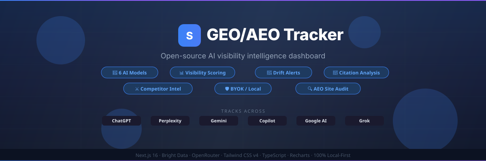

<p align="center">
  
</p>

<p align="center">
  <a href="https://www.bright.cn/?utm_source=geo-tracker-os"></a>
  <a href="https://llm-tracker-three.vercel.app"></a>
  <a href="#部署到-vercel"></a>
</p>

<h1 align="center">GEO/AEO Tracker</h1>

<p align="center">
  开源、本地优先的 AI 可见度分析控制面板。<br/>
  同时追踪品牌在 <strong>6 个 AI 模型</strong>中的表现，不受供应商锁定。
</p>

<p align="center">
  <a href="#功能"><strong>功能</strong></a> ·
  <a href="#快速开始"><strong>快速开始</strong></a> ·
  <a href="#部署到-vercel"><strong>部署</strong></a> ·
  <a href="#api-路由"><strong>API</strong></a>
</p>

---

> 🌐 **基于 [Bright Data](https://www.bright.cn/?utm_source=geo-tracker-os) 构建**——全球领先的网页数据平台。
> GEO/AEO Tracker 使用 Bright Data 的 AI 爬虫 API，可靠地采集来自 6 个 AI 模型的结构化回答。
> [获取 API 密钥 →](https://www.bright.cn/?utm_source=geo-tracker-os)

---

## 为什么开发这个项目

对于数以百万计的查询，AI 模型正在取代传统搜索。如果你的品牌没有出现在 ChatGPT、Perplexity 或 Gemini 的回答中，越来越多的受众就无法看到你。

现有工具每月收费 **200–500 美元以上**，将用户锁定在封闭生态中，还把数据存储在其服务器上。

**GEO/AEO Tracker** 提供了另一种选择：

- 🔑 **自带密钥（BYOK）**：你的数据保存在自己的设备上
- 🤖 **同时追踪 6 个 AI 模型**：覆盖范围超过付费工具
- 💸 **每月 0 美元**：自行托管、开源、永久免费
- 🛡️ **本地优先**：使用 IndexedDB 和 localStorage，无需外部数据库

## 功能

### 📋 12 个功能标签页

| 标签页 | 功能 |
|-----|-------------|
| ⚙️ **项目设置** | 配置品牌名称、别名、网站、行业、关键词和描述 |
| 💬 **提示词中心** | 管理包含 `{brand}` 变量的追踪提示词；可针对多个模型单独或批量运行 |
| 🎭 **角色扩展** | 生成面向不同角色的提示词变体，例如首席营销官、SEO 负责人或创始人 |
| 🔍 **细分领域探索** | 通过 AI 生成与你的细分领域相关、具有高意向的查询 |
| 📝 **回答** | 浏览 AI 回答，突出显示品牌和竞争对手，并使用筛选与搜索功能 |
| 📊 **可见度分析** | 使用 Recharts 折线图查看评分随时间变化的趋势，并导出 CSV |
| 🔗 **引用** | 按域名分组，分析各来源被引用的频率 |
| 🎯 **获取引用的机会** | 找出竞争对手被引用、你的品牌却未被引用的 URL，并生成联系对方的简报 |
| ⚔️ **竞争对手分析卡** | 由 AI 生成并排对比的竞争对手分析，包括优势和劣势 |
| 🏥 **AEO 审核** | 检查网站的 AI 回答引擎就绪情况：llms.txt、Schema.org、BLUF 密度和标题结构 |
| ⏱️ **自动化** | 提供用于定时运行的 Cron 和 GitHub Actions 模板 |
| 📖 **文档** | 提供可搜索的 14 章节指南，涵盖所有功能 |

### 🚀 核心能力

- 🤖 **多模型追踪**：覆盖 ChatGPT、Perplexity、Gemini、Copilot、Google AI Overview 和 Grok
- 📈 **可见度评分**（0–100）：综合品牌提及、出现位置、提及频率、引用和情感倾向
- 🔔 **变化提醒**：评分发生显著变化时自动通知
- ⏰ **定时自动运行**：按可配置的时间间隔批量抓取
- 📅 **历史对比**：追踪不同时间段之间的变化
- 🏢 **多工作区**：独立管理多个品牌或项目
- 🎨 **深色、浅色及跟随系统主题**，搭配完善的侧边栏界面

## 架构

```text
Next.js 16.1 + Turbopack
├── app/
│   ├── page.tsx                    # 主控制面板（或通过环境变量启用演示模式）
│   ├── demo/page.tsx               # 独立演示页面
│   └── api/
│       ├── scrape/route.ts         # Bright Data AI 爬虫工具（Node 运行时）
│       ├── analyze/route.ts        # OpenRouter LLM 分析（Edge 运行时）
│       └── audit/route.ts          # AEO 网站审核爬虫
├── components/
│   ├── sovereign-dashboard.tsx     # 主界面：状态、标签页和关键指标
│   └── dashboard/
│       ├── types.ts                # AppState、ScrapeRun、Provider 等类型
│       └── tabs/                   # 12 个标签页组件
├── lib/
│   ├── client/sovereign-store.ts   # 使用 IndexedDB 和 localStorage 持久化
│   ├── server/brightdata-scraper.ts # Bright Data API 集成
│   └── demo-data.ts               # 演示模式使用的确定性初始数据
└── scripts/
    ├── test-scraper.js             # API 验证脚本
    └── test-pillar.js              # 核心功能测试
```

**主要技术决策：**

- 以 **IndexedDB** 为主要存储方式（无容量限制），以 localStorage 作为尽力而为的缓存
- `/api/analyze` 使用 **Edge 运行时**（通过 OpenRouter 调用 Kimi K2.5），实现快速的全球推理
- 使用 **Bright Data 网页爬虫工具 API** 抓取 AI 模型回答，获得可靠的结构化数据
- 所有 API 路由均使用 **Zod** 验证数据结构
- 使用 **Recharts** 实现分析数据可视化
- 使用 **Tailwind CSS v4** 和 CSS 自定义属性实现主题切换

## 快速开始

### 准备工作

- Node.js 18+
- [Bright Data](https://www.bright.cn/) API 密钥和 AI 爬虫工具数据集 ID
- [OpenRouter](https://openrouter.ai/) API 密钥

### 安装与运行

```bash
git clone https://github.com/danishashko/sovereign-aeo-tracker.git
cd sovereign-aeo-tracker
npm install
```

在项目根目录创建 `.env`：

```env
BRIGHT_DATA_KEY=your_bright_data_api_key

# AI 爬虫工具数据集 ID（从 Bright Data 爬虫工具库获取）
BRIGHT_DATA_DATASET_CHATGPT=gd_xxx
BRIGHT_DATA_DATASET_PERPLEXITY=gd_xxx
BRIGHT_DATA_DATASET_COPILOT=gd_xxx
BRIGHT_DATA_DATASET_GEMINI=gd_xxx
BRIGHT_DATA_DATASET_GOOGLE_AI=gd_xxx
BRIGHT_DATA_DATASET_GROK=gd_xxx

# OpenRouter（支持 /api/analyze：竞争对手分析卡、细分领域查询生成）
OPENROUTER_KEY=your_openrouter_api_key
```

```bash
npm run dev
```

打开 [http://localhost:3000](http://localhost:3000)。

### 验证配置

```bash
npm run test:scraper    # 测试 Bright Data API 连接
npm run build           # 检查完整生产构建
npm run lint            # 运行 ESLint
```

## 部署到 Vercel

> ✅ **点击部署按钮即可启动功能完整的生产实例。** 配置过程中，系统会提示你输入 API 密钥。无需启用演示模式，也没有功能限制。

[](https://vercel.com/new/clone?repository-url=https%3A%2F%2Fgithub.com%2Fdanishashko%2Fsovereign-aeo-tracker&env=BRIGHT_DATA_KEY,BRIGHT_DATA_DATASET_CHATGPT,BRIGHT_DATA_DATASET_PERPLEXITY,BRIGHT_DATA_DATASET_COPILOT,BRIGHT_DATA_DATASET_GEMINI,BRIGHT_DATA_DATASET_GOOGLE_AI,BRIGHT_DATA_DATASET_GROK,OPENROUTER_KEY)

1. 点击上方按钮，或在克隆的仓库中运行 `vercel --prod`
2. 按提示输入 [Bright Data](https://www.bright.cn/?utm_source=geo-tracker-os) 和 [OpenRouter](https://openrouter.ai/) 的 API 密钥
3. 完成！追踪工具会自动部署，并具备完整的生产环境功能

### 🧪 仅演示模式（可选）

想要部署一个使用示例数据、无需 API 密钥的只读预览？

1. 在 Vercel → 项目设置 → 环境变量中添加 `NEXT_PUBLIC_DEMO_ONLY`，并设为 `true`
2. 重新部署。控制面板将加载预先生成的演示数据，而不会发起实时 API 调用

## API 路由

| 路由 | 运行时 | 用途 |
|-------|---------|---------|
| `POST /api/scrape` | Node.js | 使用 Bright Data AI 爬虫工具查询 AI 模型中的品牌提及 |
| `POST /api/analyze` | Edge | 使用 OpenRouter LLM 推理生成竞争对手分析卡和细分领域查询 |
| `POST /api/audit` | Node.js | 执行 AEO 网站审核，检查 llms.txt、结构化数据、BLUF 和标题 |

所有路由都包含内存缓存，以降低 API 费用。

## 技术栈

| 层级 | 技术 |
|-------|-----------|
| 框架 | Next.js 16.1 + Turbopack |
| 语言 | TypeScript（严格模式） |
| 样式 | Tailwind CSS v4，使用 `@theme inline` |
| 图表 | Recharts |
| 数据验证 | Zod |
| 存储 | IndexedDB（idb-keyval）+ localStorage |
| AI 数据抓取 | Bright Data 网页爬虫工具 API |
| LLM 推理 | OpenRouter（Kimi K2.5） |
| 部署 | Vercel |

## 许可证

MIT——欢迎使用、复刻和发布。

---

<p align="center">
  由 <a href="https://www.linkedin.com/in/daniel-shashko/">Daniel Shashko</a> 构建<br/>
  <sub>由 <a href="https://www.bright.cn/?utm_source=geo-tracker-os">Bright Data</a> 提供支持</sub>
</p>
